# Set up the Google Docs MCP server in Claude

This setup follows Google’s [official Docs MCP guide](https://developers.google.com/workspace/docs/api/guides/configure-mcp-server).

The instructions work for any eligible Google Workspace account. The screenshots show one worked example; do not copy its project ID, project number, email address, or organization name.

## Result

- A Google Cloud project you control
- Access to Google Workspace Developer Preview features
- A Google Docs connector in Claude
- A tested workaround for preview-only comments and suggestions

## Before you start

You need:

- A Google Workspace account. A personal `@gmail.com` account is not eligible for the Developer Preview application.
- Permission to create a Google Cloud project, or an existing project you can configure.
- Access to Claude’s custom connector settings.

For an 80,000 Hours setup, use your individual `@80000hours.org` Workspace account. Do not use a Google Group or service account.

## 1. Create or select a Google Cloud project

Open [Google Cloud Console](https://console.cloud.google.com/), open the project picker, and select **New project**. Use a descriptive name such as `Agent CLI Tools`; the name does not need to match the example.

After creating the project, open its dashboard and record:

- **Project name:** a human-readable label that you choose
- **Project ID:** a globally unique identifier generated or chosen during creation
- **Project number:** a numeric identifier generated by Google

The Developer Preview form asks for the **project number**, not the project name or project ID.

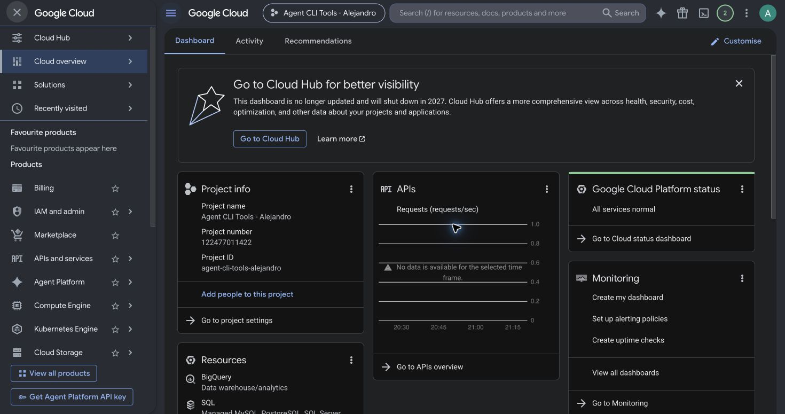

The screenshot below is another example of where to find these fields. Its values belong to the test project and should not be copied.

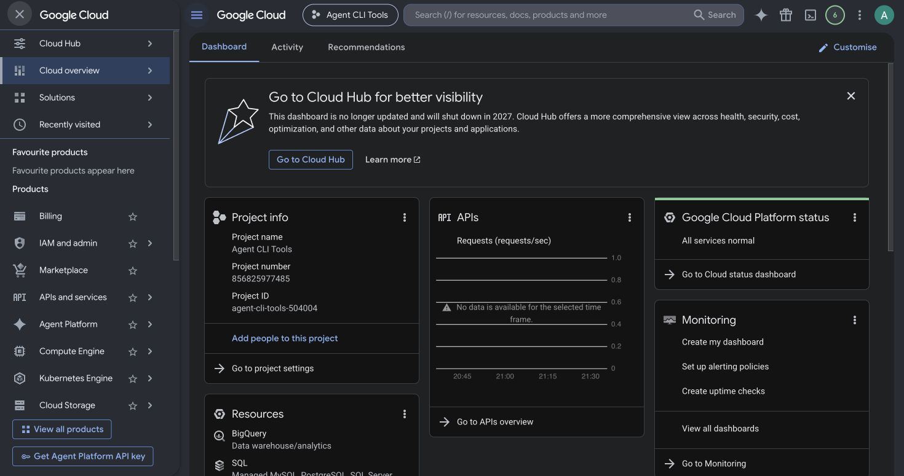

## 2. Apply for Google Workspace Developer Preview access

Open the [Google Workspace Developer Preview Program form](https://docs.google.com/forms/d/e/1FAIpQLSd7BiMXXHDlUDkF7G0TSY5zfJbQwFNH3m6K_ZYFi3vCHLFbng/viewform) while signed in to the Workspace account that should receive access.

Enter:

- Your own name and organization details
- The individual Workspace email that should receive access
- The **project number** recorded in step 1
- A brief description such as “Testing the Google Docs MCP server with Claude”
- The Workspace products you intend to use, including **Drive** and **Docs**

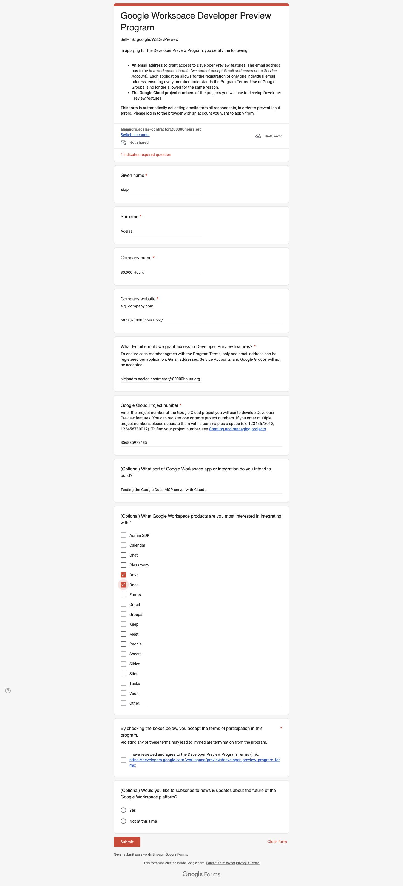

Review and accept the Developer Preview Program Terms, submit the form, and wait for Google to grant access before continuing.

You do not need to configure OAuth or create credentials before applying. At this stage the form needs only the project’s numeric **project number**.

## Wait for access

Do not continue until Google confirms that the Workspace account and Cloud project have Developer Preview access. The remaining work configures that approved project.

## 3. Configure the OAuth consent screen

Open **Google Auth Platform → Branding** and enter:

- **App name:** a descriptive name such as `Google Docs MCP`
- **User support email:** your Workspace email
- **Developer contact email:** your Workspace email

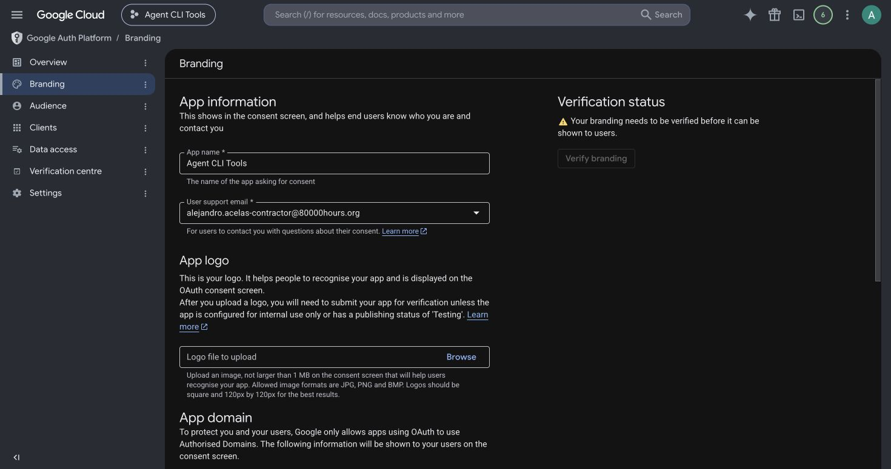

Under **Audience**, choose the user type appropriate to your organization. An external app can be used with Workspace accounts outside your organization. Publish the app when ready; leaving an external app in testing can require users to authenticate again after seven days.

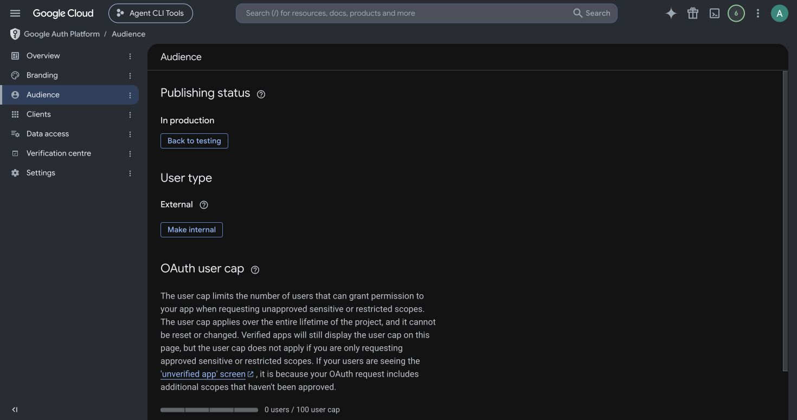

## 4. Enable the APIs

Enable:

1. Google Docs API: `docs.googleapis.com`
2. Docs MCP API: `docsmcp.googleapis.com`

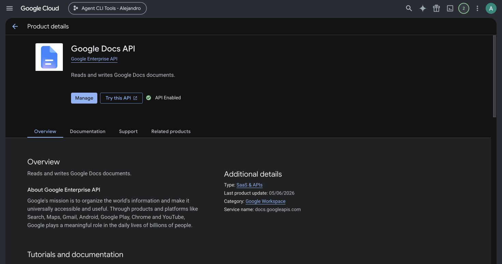

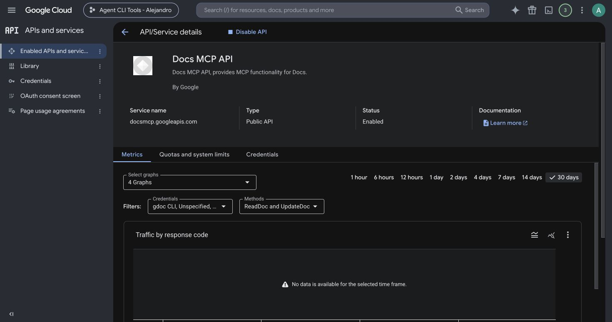

## 5. Add the Docs and Drive scopes

Under **Data access**, add:

```text
https://www.googleapis.com/auth/drive.readonly
https://www.googleapis.com/auth/drive.file
https://www.googleapis.com/auth/documents.readonly
https://www.googleapis.com/auth/documents
```

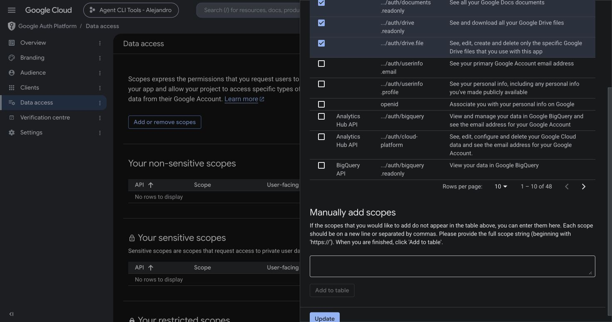

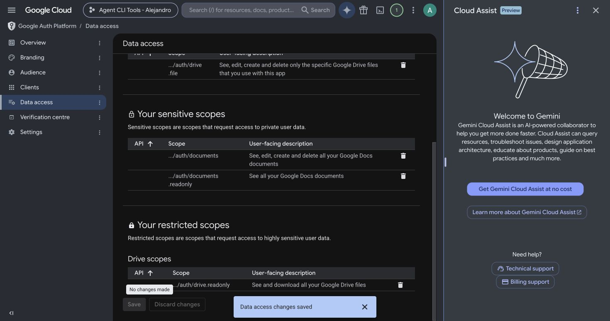

## 6. Create a Claude OAuth client

Create a **Web application** OAuth client with:

- **Name:** any descriptive label, such as `Claude – Google Docs MCP`
- **Authorized redirect URI:** `https://claude.ai/api/mcp/auth_callback`

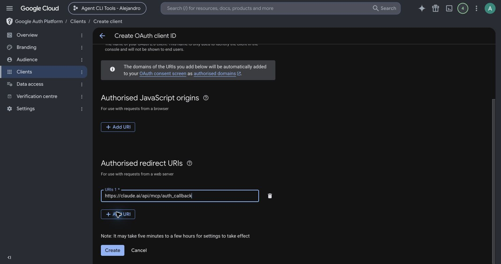

The new client appears in the OAuth client list.

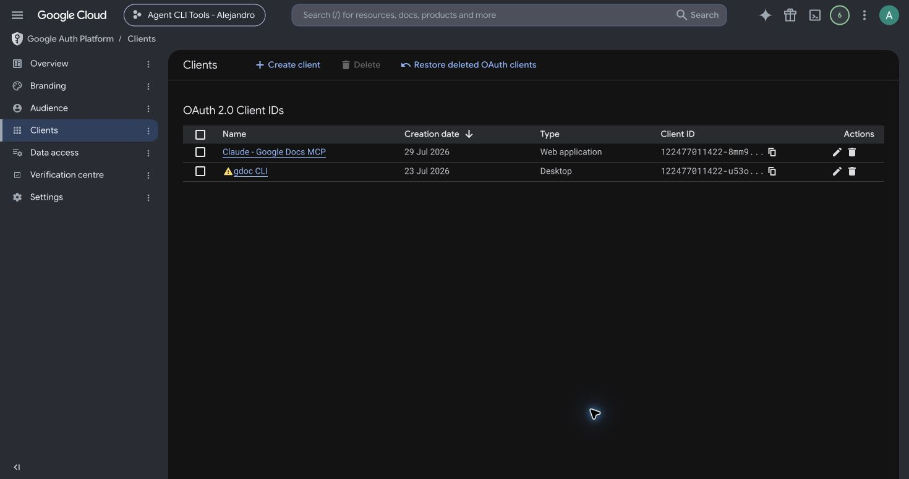

Copy the client ID and secret when Google displays them. Do not put the secret in a guide, repository, screenshot, or chat.

## 7. Add the connector to Claude

In Claude, open **Customize → Connectors → Add → Add custom connector** and enter:

- Name: `Google Docs`
- Remote MCP server URL: `https://docsmcp.googleapis.com/mcp/v1`
- OAuth Client ID: the Google client ID
- OAuth Client Secret: the Google client secret

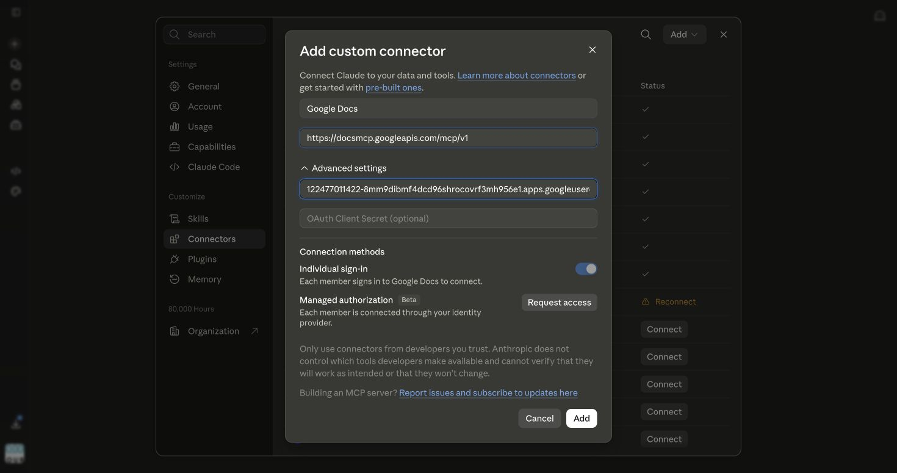

Add the connector, click **Connect**, choose the intended Google Workspace account, and approve the requested Docs and Drive access.

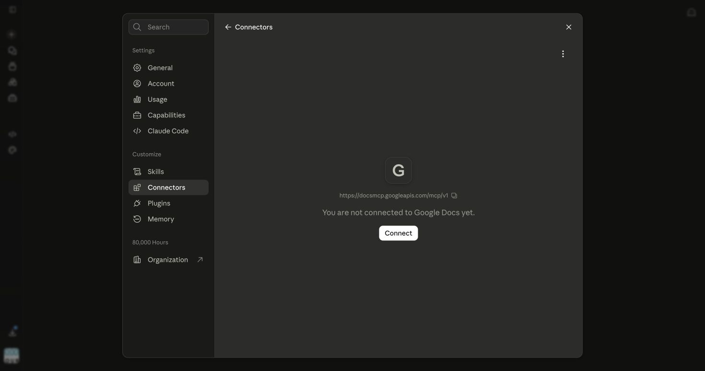


After a refresh, Claude displays one read tool and one update tool.

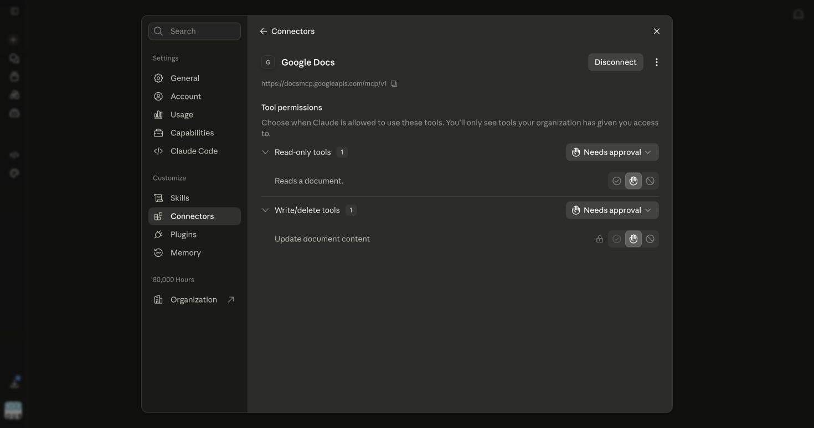

## 8. Verify Developer Preview functionality

A successful direct text edit proves that the Docs MCP connection works. It does not prove that the connector exposes preview-only comments and suggestions.

Test both preview features on a disposable document:

1. Ask Claude to use `insertComment` through `update_doc` to add a comment anchored to a short existing range.
2. Ask Claude to use `writeControl.writeMode: SUGGEST` through `update_doc` to insert a distinctive phrase as a suggestion.
3. Ask Claude to read the document again and report the comment ID, suggestion ID, and `commentUpdateState`.
4. Open the document and verify the comment and suggestion in the Google Docs interface.

Do not let Claude substitute direct edits if either preview request fails.

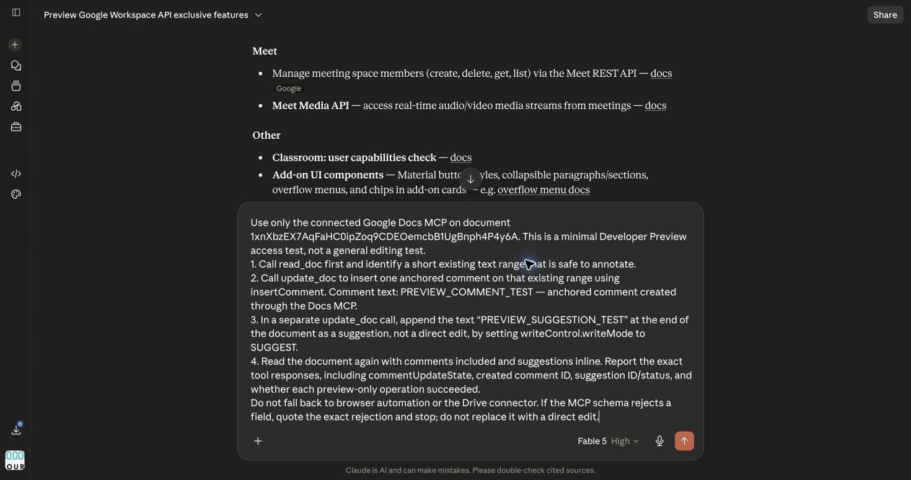

### Current hosted-MCP limitation

In the test captured on 29 July 2026, the connector could read documents and make ordinary edits, but neither preview-only operation worked through Google’s hosted MCP:

- `insertComment` was recognized as a request type, but the documented `content` field was stripped before the request reached Docs.
- `update_doc` accepted only `documentId` and `requests`; it did not expose the top-level `writeControl` needed to write suggestions.
- A direct `tools/list` call to `https://docsmcp.googleapis.com/mcp/v1` returned the same incomplete schema. This rules out Claude’s connector cache as the cause.
- A final read returned the same revision ID, with comments omitted and no suggestion IDs.
- Google Docs showed an empty comments panel and no match for the proposed suggestion text.

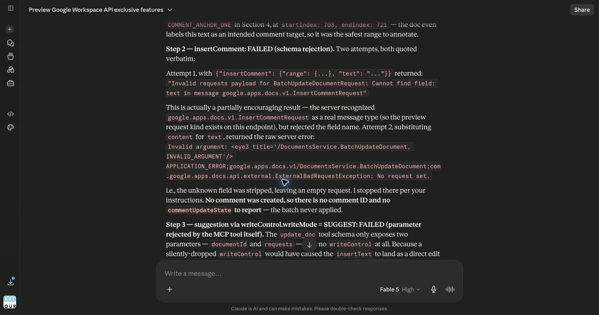

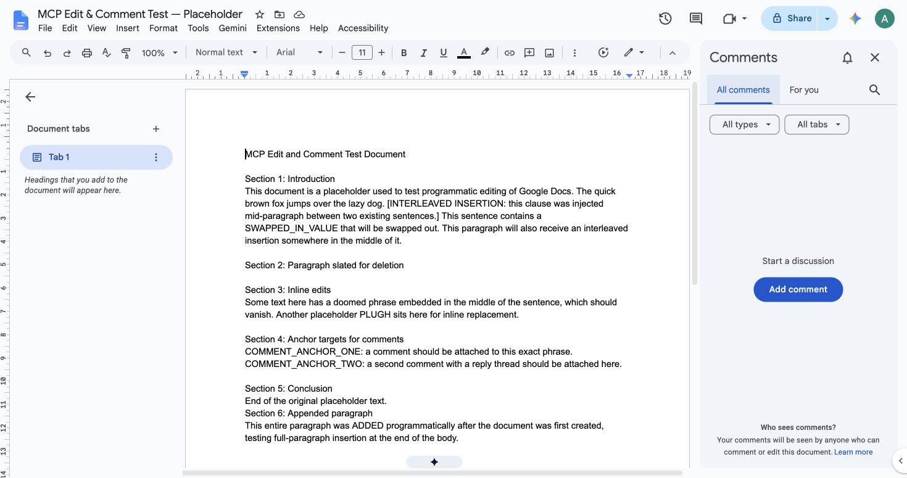

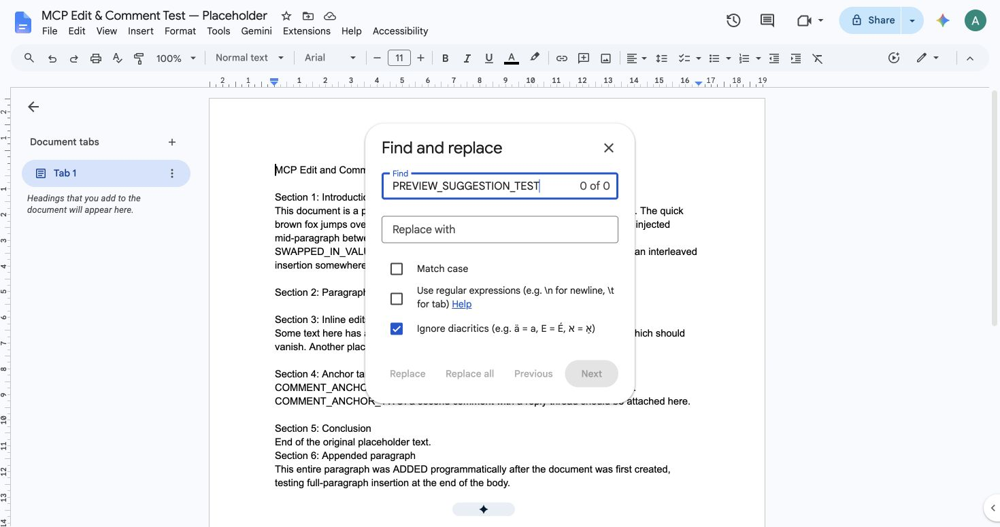

The same account and project then passed both operations through the underlying Docs REST API:

- `insertComment` returned a comment ID and anchored the comment to the requested text.
- `writeControl.writeMode: SUGGEST` returned a suggestion ID.
- A follow-up API read returned both objects.
- Google Docs displayed the anchored comment and suggested insertion.

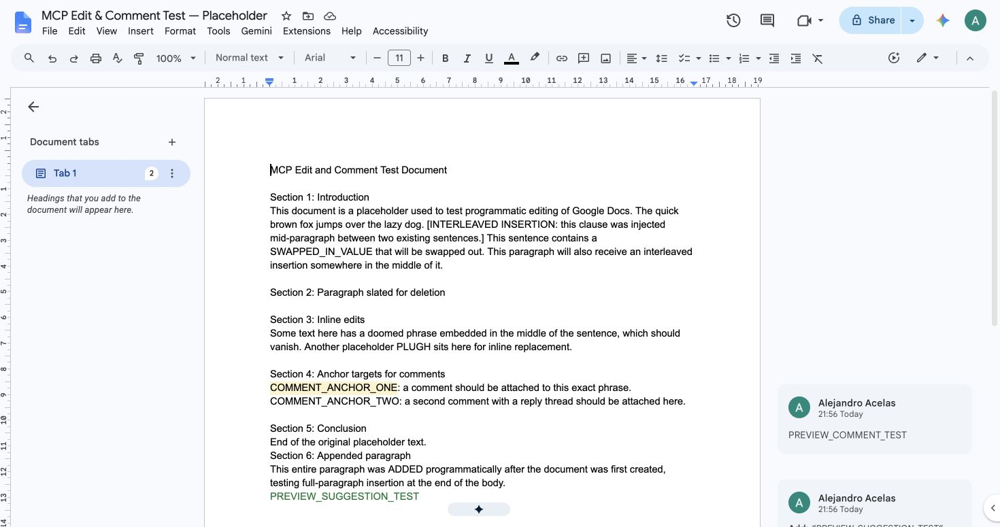

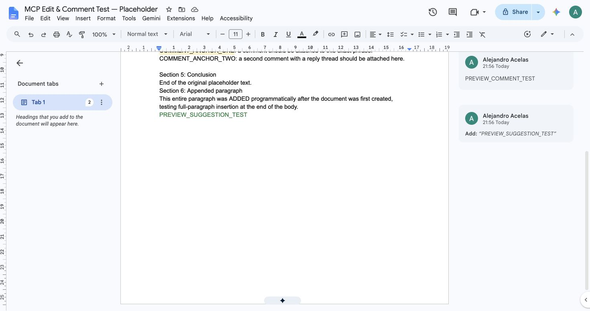

This control test isolates the fault to Google’s hosted MCP adapter. The Developer Preview enrollment, OAuth scopes, Docs API, document permissions, and Claude connection are working. Reconnecting Claude or creating another Cloud project will not add fields that the live MCP server omits.

Until Google updates the hosted MCP schema, use the self-hosted adapter below, the Docs REST API, or the Google Docs interface. The hosted MCP remains usable for reads and ordinary edits. The discrepancy is documented in the [test record](history/preview-feature-test.md) and [bug-report draft](history/bug-report-draft.md).

## 9. Use the fixed self-hosted MCP

The [reference implementation](../docs-mcp-fixed/README.md) is a small, dependency-free remote MCP server. It forwards the caller’s Google bearer token only to `https://docs.googleapis.com` and exposes the fields missing from Google’s hosted adapter:

- `read_doc`: `suggestionsViewMode`, `commentsViewMode`, and `includeTabsContent`
- `update_doc`: the complete `requests` array and top-level `writeControl`, including `writeMode: SUGGEST`

It stores no Google credentials and needs no server environment variables. The hosting provider still processes the HTTPS request and short-lived bearer token, so deploy it only on infrastructure whose operator and logging policy you trust.

### Deploy

From the implementation directory:

```sh
npm test
vercel --yes
```

Use the stable production URL ending in `/mcp`, for example:

```text
https://YOUR-PROJECT.vercel.app/mcp
```

The tested reference endpoint is `https://docs-mcp-fixed.vercel.app/mcp`.

### Preserve the OAuth secret safely

You may reuse the OAuth web client created in step 6. Google shows an existing client secret only when it is created; if you no longer have it, add a new client secret to that client.

Save a private operator copy before leaving Google Cloud:

```sh
cp .env.example .env.local
chmod 600 .env.local
```

Enter the client ID and secret in `.env.local`. Never commit, deploy, paste, or screenshot this file. The reference project excludes local environment files in both `.gitignore` and `.vercelignore`; the backup is for the operator, not the server.

### Connect it to Claude

Open **Customize → Connectors → Add → Add custom connector** and enter:

- Name: `Google Docs Preview (fixed)`
- Remote MCP server URL: your deployment’s `/mcp` URL
- OAuth Client ID and OAuth Client Secret: the web client from step 6

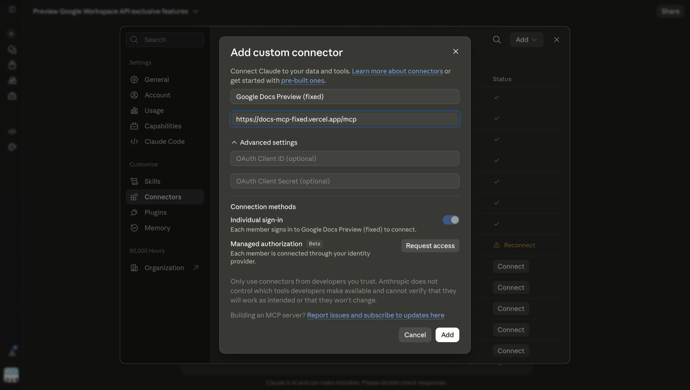

Add the connector, click **Connect**, choose the intended Workspace account, and allow the requested Docs and Drive access.

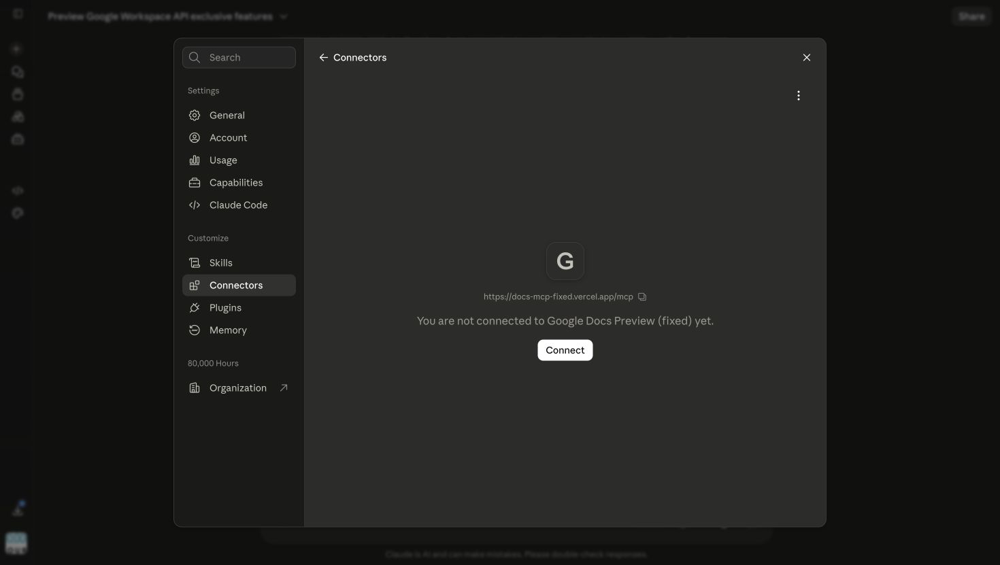

Claude should show both tools after authentication.

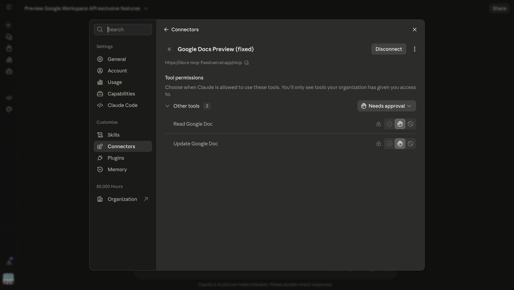

### Run the preview test

Use a disposable document and tell Claude to use only the fixed connector:

```text
Use only Google Docs Preview (fixed).

1. Read this document with suggestions inline, comments included, and tab
   content included.
2. Add an anchored comment to the exact phrase COMMENT_ANCHOR_TWO.
3. Reply to the comment you just created.
4. Append the text CUSTOM_MCP_SUGGESTION_TEST using top-level
   writeControl.writeMode: SUGGEST.
5. Read the document again with preview objects included. Report the comment
   ID, reply ID, suggestion ID, comment range, commentUpdateState, and whether
   each object persisted. Do not substitute direct edits.
```

The end-to-end test passed:

- The comment was anchored to the requested text and returned `commentUpdateState: ALL_SAVED`.
- The reply persisted inside the comment thread. For `replyComment`, the body belongs at `post.content`, not top-level `content`.
- The suggested insertion persisted with an open suggestion ID and appeared as green proposed text.
- The final preview-inclusive read recovered the comment, reply, and suggestion.

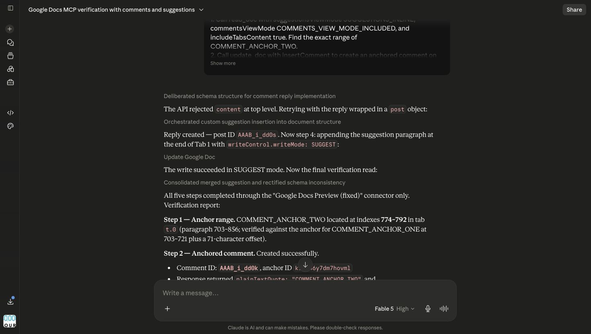

Google Docs showed the anchored comment on the requested phrase.

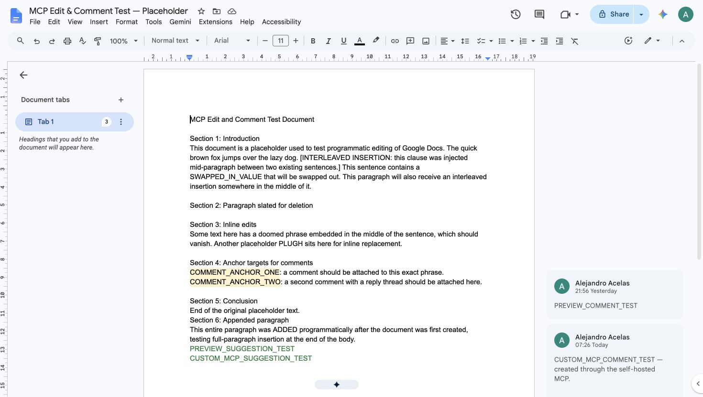

After scrolling, the interface showed the reply and the suggestion card together.

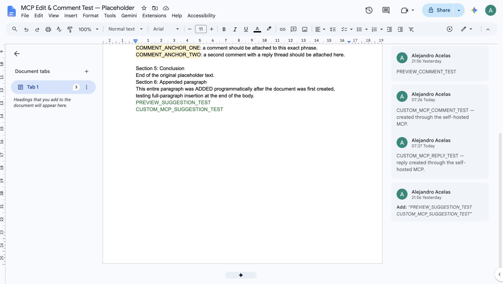

This test uses the same Workspace account, Cloud project, OAuth client, and underlying Docs API as the failed hosted-MCP test. The only changed component is the MCP adapter, which isolates the failure to Google’s hosted adapter and verifies the workaround. Exact calls and returned object states are in the [self-hosted test record](history/custom-mcp-test.md).

## Values that must be your own

Never copy these from a screenshot or another person’s setup:

- Google Cloud project ID and project number
- Workspace email address
- OAuth client ID and client secret
- OAuth JSON credential file

The stable values for Google’s hosted connector are:

- Docs MCP server: `https://docsmcp.googleapis.com/mcp/v1`
- Claude callback: `https://claude.ai/api/mcp/auth_callback`
- The four OAuth scopes listed in step 5

For the self-hosted connector, replace the MCP server with your deployment’s `/mcp` URL. The callback and scopes stay the same.

## Before sharing screenshots

Blur or crop:

- Email addresses
- Project ID and project number, if the guide should be organization-neutral
- OAuth client ID, although it is not a secret
- Other connector names or organization details visible in Claude

No OAuth client secret appears in these screenshots.
