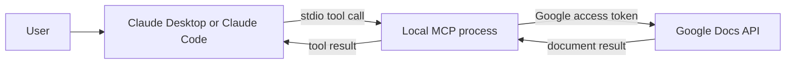
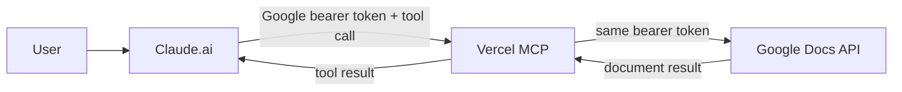
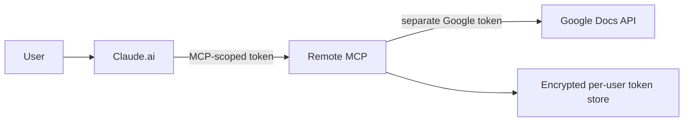

# Design and security

## What Google’s hosted MCP breaks

Google’s hosted Docs MCP at `https://docsmcp.googleapis.com/mcp/v1` does not expose the complete Developer Preview API schema.

| Needed behavior | Missing or changed field | Effect |
| --- | --- | --- |
| Create an anchored comment | `insertComment.content` is stripped | Google rejects the request |
| Create a suggestion | Top-level `writeControl` is absent | `writeMode: SUGGEST` cannot be sent |
| Read comments and replies | `commentsViewMode` is absent | Preview comment threads cannot be requested |
| Read suggestion state reliably | Preview and tab controls are incomplete | The client cannot recover the full result |

The same account, Cloud project, document, and OAuth grant passed these calls through `docs.googleapis.com`. The adapter—not enrollment or the Docs API—is the failed component.

## What this implementation changes

- Exposes `commentsViewMode`, `suggestionsViewMode`, and `includeTabsContent` on `read_doc`.
- Exposes the complete request array and top-level `writeControl` on `update_doc`.
- Preserves `insertComment`, `addCommentReply`, and suggestion fields.
- Fixes the Google API origin to `https://docs.googleapis.com`.
- Requests only `https://www.googleapis.com/auth/documents`.
- Contains no explicit application logging of tokens, request headers, or document bodies. Hosting and network providers can still observe or log traffic metadata, and users cannot infer that a live deployment matches this source tree.

The local and remote transports share the same tool implementation. Their trust boundaries are different.

## Build your own

Give this specification to an AI coding agent if you prefer an independent implementation:

> Build a Google Docs MCP with `read_doc` and `update_doc`. `read_doc` must expose `suggestionsViewMode`, `commentsViewMode`, and `includeTabsContent`. `update_doc` must forward a raw Docs API `requests` array and top-level `writeControl`, including `writeMode: SUGGEST`, without stripping preview request fields such as `insertComment.content` or `addCommentReply.post.content`. Fix Docs tool calls to `https://docs.googleapis.com/v1/documents`; never accept a caller-controlled upstream URL, and reject redirects. Request only the Google Docs scope unless another API call proves an additional scope necessary. Add tests for schema exposure, exact request forwarding, the fixed upstream origin, redirect rejection, missing-authorization behavior, token refresh, file permissions, and the absence of token echoing or logging. Provide local stdio transport with installed-app OAuth and PKCE. Store local tokens in the OS keychain for a packaged release. If you provide a remote transport, implement separate MCP and Google tokens; do not pass a Google token through as the MCP token.

## Data flows

### Local stdio

The OAuth refresh token stays on the device as plaintext JSON protected by mode `600`. That blocks other ordinary local accounts, not same-user malware or an administrator. Selected document content still reaches Claude as a tool result.

### Current experimental remote

Vercel and the MCP operator process the token and document data. TLS and a no-explicit-logs code path do not prevent an operator, compromised deployment account, or active host from reading them. This trust is irreducible while a third-party remote proxy sits in the path. Forwarding the same Google token is [token passthrough, which MCP explicitly forbids](https://modelcontextprotocol.io/docs/2026-07-28/tutorials/security/security_best_practices#token-passthrough).

### Production remote

The broker in this repository implements this separation with short-lived opaque MCP access tokens, rotating refresh tokens, exact resource and client binding, one-time authorization codes, and encrypted Google grants in Redis. Its ownership and rollout requirements are in [Organization-owned remote MCP](organization-owned-remote.md). The public test deployment has not been switched to this mode.

## Credential and data classification

| Asset | Lifetime | If stolen |
| --- | --- | --- |
| OAuth client ID | Long-lived; public identifier | Identifies the app; not sufficient for access |
| Web OAuth client secret | Long-lived confidential credential supplied to Claude/Anthropic’s connector configuration | Can enable app impersonation; rotate it |
| Desktop installed-client secret | Long-lived value embedded in the downloaded installed-app JSON | Not a confidential boundary; still keep the credential file out of the repository |
| Google access token | Usually short-lived | Can call Google APIs allowed by its scopes |
| Google refresh token | Long-lived | Can mint new access tokens until revoked |
| Document body and comments | Persistent content | May expose confidential work |

“Stores no credentials” is not enough to make a remote proxy safe. The proxy and hosting provider still process transient tokens and document data.

## Threats and controls

| Threat | Remote control | Local control |
| --- | --- | --- |
| Operator or host captures tokens | No complete mitigation: self-host or trust the operator; production design still needs separate MCP/Google tokens and an encrypted store | Removes the independent MCP host; Claude and Google remain |
| Token replay after theft | Validate issuer, audience, scope, expiry, and resource; use sender-constrained tokens where supported | Prevent theft with an OS keychain; rely on short access-token lifetimes and Google revocation. Mode `600` alone does not stop replay |
| Excessive Google access | Docs-only scope; add Picker/per-file grants for `drive.file` if product UX supports them | Same |
| Prompt injection causes writes | Separate read/write tools; configure one-time, per-call approval in the client | Same |
| Malicious server update | Pin releases; publish checksums and release notes | Install reviewed commits or signed bundles |
| Cross-user token mix-up | Per-user storage keys and tests | Not applicable |
| Supply-chain compromise | Minimal dependencies; locked builds | Minimal dependencies; reviewed local code |
| Local malware or malicious MCP | Not applicable | MCP process has user privileges; keep code narrow and reviewed |

MCP servers can change behavior after installation. Do not enable permanent approval for writes on sensitive documents.

## Recommendation

- Use local stdio for confidential individual work when Claude Desktop or Claude Code is acceptable.
- Use an organization-owned, OAuth-brokered remote service for Claude.ai, mobile, or team workflows.
- Use the current remote endpoint only for disposable or non-sensitive tests.

Claude.ai custom connectors originate from Anthropic’s cloud and therefore require a publicly reachable endpoint; localhost and stdio are not available there. Anthropic documents local MCP as a separate Claude Desktop mechanism. Local execution removes Vercel and this repository’s operator from the data path, but it does not prevent selected tool results from going to Claude or Google, and its current plaintext token file remains exposed to same-user malware.

## Production remote checklist

- [x] Separate MCP access tokens from Google access tokens.
- [x] Validate token audience, resource, expiry, client, and scopes.
- [x] Use Authorization Code with PKCE, exact redirect URIs, and one-time state.
- [x] Encrypt Google refresh tokens and isolate grants per authorization.
- [x] Keep secrets outside the repository.
- Log metadata only—never tokens or document bodies.
- Add request size, rate, and timeout limits.
- Use a canonical public origin; never derive authorization metadata from an unvalidated Host header.
- Fix Docs traffic to the Docs API and reject upstream redirects.
- Publish an incident and revocation procedure.
- Transfer the deployment, OAuth clients, data store, encryption key, and administration to organization-owned accounts.
- Complete a security review before offering the endpoint as the default.

Primary references:

- [MCP authorization](https://modelcontextprotocol.io/specification/2025-06-18/basic/authorization)
- [MCP security best practices](https://modelcontextprotocol.io/docs/2026-07-28/tutorials/security/security_best_practices)
- [Google OAuth installed apps](https://developers.google.com/identity/protocols/oauth2/native-app)
- [Google OAuth policies](https://developers.google.com/identity/protocols/oauth2/policies)
- [Google OAuth best practices](https://developers.google.com/identity/protocols/oauth2/resources/best-practices)
- [Google Docs comments and suggestions](https://developers.google.com/workspace/docs/api/how-tos/suggestions)
- [Google API OAuth scopes](https://developers.google.com/identity/protocols/oauth2/scopes)
- [Claude remote custom connectors](https://support.claude.com/en/articles/11175166-get-started-with-custom-connectors-using-remote-mcp)
- [Claude local MCP servers](https://support.claude.com/en/articles/10949351-getting-started-with-local-mcp-servers-on-claude-desktop)
