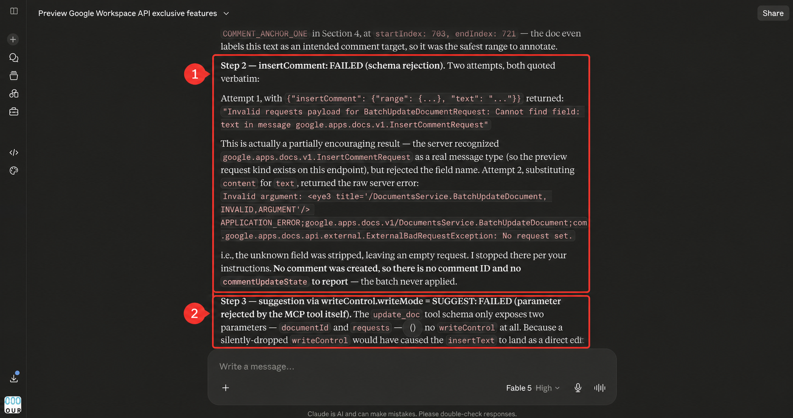

# Why the official Google Docs MCP is not the main setup

Tested 29–30 July 2026.

Google’s official hosted MCP can read documents and make ordinary edits. It could not create Developer Preview comments or suggestions in our controlled test.

## Hosted result

- `insertComment` was recognized, but the documented `content` field was stripped.
- `update_doc` exposed `documentId` and `requests`, not top-level `writeControl`.
- `read_doc` omitted the preview comment-view control.
- A direct `tools/list` request to the hosted endpoint returned the same incomplete schema, ruling out Claude’s connector cache.

## REST API control

Using the same:

- Workspace account
- Cloud project
- OAuth grant
- document
- requested operations

the Google Docs REST API:

- created an anchored comment and returned a comment ID;
- created a suggested insertion and returned a suggestion ID;
- returned both objects on a preview-inclusive read;
- displayed both in Google Docs.

The self-hosted adapter then passed the same test through Claude. Only the MCP adapter changed.

## Conclusion

The Developer Preview enrollment, OAuth grant, Docs API, and document permissions work. Reconnecting Claude or creating another Cloud project cannot add schema fields that the hosted MCP omits.

Evidence:

- [Preview feature test](history/preview-feature-test.md)
- [Self-hosted test](history/custom-mcp-test.md)
- [Bug-report draft](history/bug-report-draft.md)
