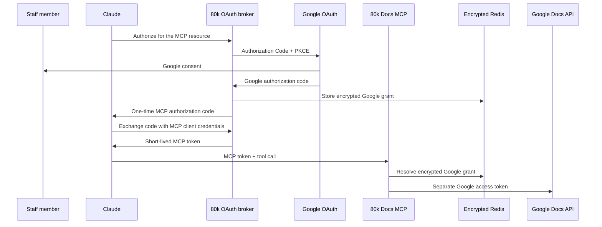

# Organization-owned remote MCP

## Direct answer

80,000 Hours can make this MCP available in Claude.ai without Anthropic approving or hosting it.

Use Claude’s **Individual sign-in** connector mode:

1. 80,000 Hours owns and hosts the MCP and its OAuth broker.
2. A Claude **Owner** adds its URL and MCP client credentials under **Organization settings → Connectors**.
3. The connector then appears in **Customize → Connectors** for staff.
4. Each staff member clicks **Connect** and authorizes their own Google account.

Adding the connector is how the Claude Owner communicates organizational approval to Claude. There is no separate Anthropic submission, marketplace review, or approval email.

Anthropic’s **Managed authorization** beta is a different, optional product for provisioning connector access centrally through an identity provider. It is not required for this MCP.

Staff do not create Google Cloud projects or handle OAuth credentials. While the Docs
features remain in Developer Preview, the program must still register each tester’s
Workspace email against the shared project.

## Guides

- [Approvals and responsibilities](organization-owned-remote/approvals.md): who can do each step, what requires an administrator, and where approval is granted.
- [Deployment runbook](organization-owned-remote/runbook.md): the complete sequence from Google Preview enrollment to a working connector.
- [How authentication reaches Claude](organization-owned-remote/auth-flow.md): what Claude stores and sends, and why no Google token is passed through.
- [Pilot result](organization-owned-remote/pilot.md): what passed in Claude.ai and what remains before production.
- [Staff onboarding](user-onboarding.md): the end-user Connect flow.

## What is already true

The source tree and temporary pilot deployment use the secure broker: Claude receives
MCP-specific tokens; Google grants are encrypted and remain inside the service. The
Claude.ai pilot passed comments, replies and suggestions.

The protocol is ready for an organizational rollout. Replace the pilot’s development
ownership of every row:

| Component | Required production owner |
| --- | --- |
| Google Cloud project and OAuth client | 80,000 Hours |
| MCP deployment and domain | 80,000 Hours |
| Redis account | 80,000 Hours or an approved provider account |
| Token-encryption key and MCP client secret | 80,000 Hours secret manager |
| Claude connector record | 80,000 Hours Claude organization |
| Operators and revocation process | Named 80,000 Hours staff |

Owning the accounts is a technical control. An internal security decision is still required because the deployment processes selected document bodies and can decrypt Google grants while serving requests.

## Authentication design

Claude never receives the Google refresh token. The bearer token sent to the MCP is random, short-lived, bound to this MCP resource, and useless at Google APIs.

## Why Google’s hosted MCP is different

Google’s hosted MCP sends a Google-issued token to a Google-owned MCP resource, which then calls a Google API. Google owns the authorization server, MCP resource, and Docs API trust domain.

Our legacy proxy instead forwards the same Google bearer token through a non-Google server. The MCP specification forbids that token passthrough. The broker in this repository fixes it by issuing a separate MCP token.

Google’s hosted MCP still omits the required preview fields from its live tool schema. Its authentication architecture is useful; its Docs adapter cannot yet perform this project’s comments-and-suggestions workflow.

## Sources

- [Claude: custom remote MCP connectors](https://support.claude.com/en/articles/11175166-get-started-with-custom-connectors-using-remote-mcp)
- [Claude: enterprise-managed connector authorization](https://support.claude.com/en/articles/15537633-authorize-mcp-connectors-for-your-entire-organization)
- [Google Workspace Developer Preview Program](https://developers.google.com/workspace/preview)
- [Google Workspace OAuth app controls](https://support.google.com/a/answer/7281227)
- [MCP authorization specification](https://modelcontextprotocol.io/specification/2025-06-18/basic/authorization)
- [MCP token-passthrough prohibition](https://modelcontextprotocol.io/docs/2026-07-28/tutorials/security/security_best_practices#token-passthrough)
