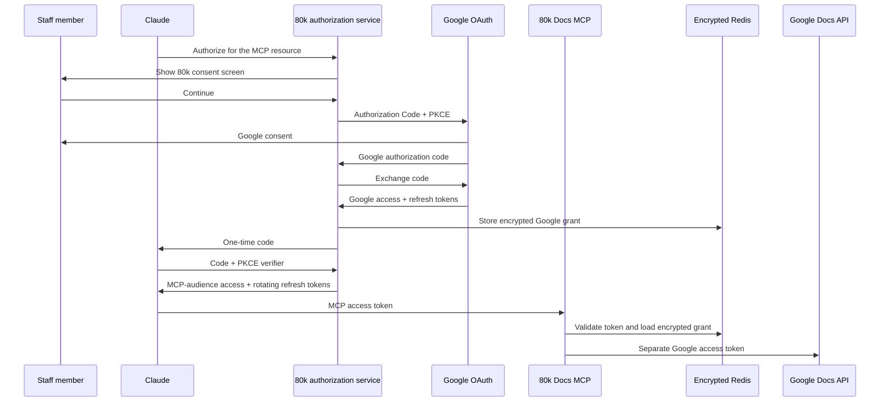

# Organization-owned remote MCP

## Decision

80,000 Hours can operate a remote Google Docs MCP for staff if the organization owns the authorization boundary and accepts its infrastructure providers as subprocessors.

The organization should own:

- the Google Cloud project and OAuth client;
- the MCP OAuth client issued to Claude;
- the deployment and domain;
- the token-encryption keys;
- the Redis account that holds one-time codes and encrypted grants;
- access control, logging policy, incident response, and revocation.

The current shared test endpoint is owned by an individual and forwards Google access tokens unchanged. It is not the organization-owned design.

## Why Google’s hosted MCP is different

Google publishes this protected-resource metadata:

```json
{
  "authorization_servers": ["https://accounts.google.com/"],
  "resource": "https://docsmcp.googleapis.com/mcp/v1"
}
```

Claude performs OAuth with Google using a Web OAuth client created in the user’s Google Cloud project. It sends the resulting token to a Google-owned MCP resource. Google owns the authorization server, MCP resource, and Docs API trust domain.

Our current proxy advertises Google as its authorization server even though the protected resource is hosted by us. It then forwards the same bearer token to the Docs API. The MCP specification forbids this: an MCP must accept a token issued for itself and use a separate upstream token.

Google’s hosted MCP still omits required preview fields from its live `tools/list` schema. On 30 July 2026, `read_doc` exposed only `documentId`; `update_doc` exposed only `documentId` and `requests`. Its authentication model is useful, but its tool adapter still cannot perform the preview workflow.

## Proposed flow



Claude never receives the Google refresh token. The bearer token sent to the MCP is random, short-lived, audience-bound, and useless at Google APIs.

## Security properties

The service must:

- require Authorization Code with PKCE;
- validate exact client IDs, redirect URIs, and MCP resource indicators;
- show organization-branded consent before redirecting to Google;
- make authorization codes single-use and short-lived;
- issue opaque MCP access tokens with a 10-minute lifetime;
- rotate MCP refresh tokens on every use;
- encrypt Google grants before writing them to Redis;
- bind every record to the canonical MCP resource and OAuth client;
- reject Google tokens at the MCP endpoint;
- use `GETDEL` or an equivalent atomic operation for one-time values;
- reject outbound redirects and fix Google endpoints in source;
- keep document bodies, headers, and tokens out of application logs.

This removes token passthrough. It does not remove remote-host trust: Vercel runs the code, Upstash stores ciphertext, and whoever controls the deployment and encryption key can access staff grants and documents.

## Infrastructure and ownership

| Component | Initial implementation | Organization-owned target |
| --- | --- | --- |
| Domain and deployment | Individual Vercel project | 80,000 Hours Vercel team and domain |
| OAuth broker | This repository | 80,000 Hours deployment |
| Transaction store | Upstash Redis, free tier | 80,000 Hours Upstash account or approved equivalent |
| Google OAuth client | Development project | 80,000 Hours Google Cloud project, Internal audience |
| MCP client credentials | Deployment secrets | Managed in 80,000 Hours secret manager and Claude admin settings |
| Encryption key | Deployment secret | Organization-managed key with rotation procedure |
| Operators | Individual developer | Named 80,000 Hours administrators |

## Approval request

Ask 80,000 Hours to approve:

1. an Internal Google OAuth app requesting the Docs scope;
2. an organization-owned Vercel project and domain;
3. Upstash Redis as a subprocessor, or an approved replacement;
4. named administrators who can deploy or read production secrets;
5. a pilot group using disposable or non-confidential documents;
6. security review before confidential use.

The approval should state that Claude and Google receive selected document content, while Vercel processes requests and an encrypted Google grant is stored in Redis.

## Rollout gates

### Development

- Unit-test OAuth discovery, PKCE, audience binding, one-time codes, encryption, expiry, and refresh rotation.
- Test against a disposable Google Doc.
- Confirm a Google token is rejected at the MCP endpoint.
- Confirm an MCP token is rejected by Google.

### Pilot

- Transfer the project, OAuth client, deployment, Redis, and secrets to organization-owned accounts.
- Use an Internal Google OAuth audience and a small test group.
- Enable per-call approval for writes.
- Review provider logs and retention settings.
- Exercise user revocation and encryption-key rotation.

### Production

- Complete an 80,000 Hours security review.
- Document subprocessors and data flow.
- Add monitoring for failed token exchanges, replay, and abnormal write volume without logging tokens or document bodies.
- Publish an incident and offboarding procedure.
- Reassess the Google-hosted MCP when its live schema exposes the required preview fields.

## References

- [Google Docs MCP configuration](https://developers.google.com/workspace/docs/api/guides/configure-mcp-server)
- [MCP authorization specification](https://modelcontextprotocol.io/specification/2025-06-18/basic/authorization)
- [MCP security best practices](https://modelcontextprotocol.io/docs/2026-07-28/tutorials/security/security_best_practices#token-passthrough)
- [Claude remote custom connectors](https://support.claude.com/en/articles/11175166-get-started-with-custom-connectors-using-remote-mcp)
