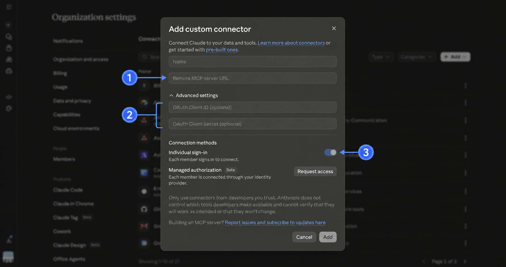

# Approvals and responsibilities

## The minimum approval chain

| Decision | Who can perform it | Where it happens | External wait? |
| --- | --- | --- | --- |
| Register preview user and project | Any applicant using the intended Workspace account | [Google Workspace Developer Preview application](https://docs.google.com/forms/d/e/1FAIpQLSd7BiMXXHDlUDkF7G0TSY5zfJbQwFNH3m6K_ZYFi3vCHLFbng/viewform) | Yes; Google says usually a couple of days |
| Create an organization-owned Cloud project | User with Google Cloud Project Creator on the target organization or folder | Google Cloud Console or `gcloud` | No after IAM access |
| Configure the Google OAuth app and client | Project Owner, Editor, or OAuth Config Editor | Google Auth Platform in the project | No after IAM access |
| Permit the Docs OAuth scope | Workspace administrator with the Security Settings privilege | Admin Console → Security → Access and data control → API controls | No after admin access; propagation can take up to 24 hours |
| Approve hosting and subprocessors | 80,000 Hours’ internal security or operations owner | Internal decision | Organization-specific |
| Create or transfer deployment, Redis, domain, and secrets | Owners of the organization’s hosting, storage, DNS, and secret-management accounts | Provider consoles | No after account access |
| Add the connector to Claude | Claude Owner or Primary Owner | Claude → Organization settings → Connectors | No Anthropic review |
| Connect a staff Google account | Each staff member | Claude → Customize → Connectors → Connect | No, after the previous approvals |

## What a developer can do alone

A developer can complete these steps without a Workspace or Claude administrator if they already have the corresponding account permissions:

- build and test the MCP locally;
- deploy it to an organization-owned hosting project;
- provision Redis in an organization-owned provider account;
- generate the encryption key and MCP client secret directly into the secret manager;
- create the Google Web OAuth client if they have `roles/oauthconfig.editor`, Project Editor, or Project Owner;
- submit their own Workspace email and the Cloud project to Google’s Developer Preview Program;
- run the end-to-end test after the connector becomes available.

The word “approval” does not create any technical state here. The accounts, IAM roles, secrets, and connector record do.

## What requires explicit administrator action

### Google Workspace Developer Preview

Comments and suggestions are Pre-GA Docs API features. Google registers both:

- each participating Google Workspace email; and
- each Google Cloud project number.

The initial applicant uses the [program application](https://docs.google.com/forms/d/e/1FAIpQLSd7BiMXXHDlUDkF7G0TSY5zfJbQwFNH3m6K_ZYFi3vCHLFbng/viewform). Existing members use Google’s forms to [add or remove email addresses](https://docs.google.com/forms/d/e/1FAIpQLScXoXMKj6pzgLNXzwuA2n4kWfFXgebXO8pJy6aZzH9C4hmw5w/viewform) and [add or remove Cloud projects](https://docs.google.com/forms/d/e/1FAIpQLSebRuwRJzPYpIGAg2HcEhX7uVDjbCvABb2hNsrrTWj9PaPPKw/viewform).

This is external Google approval. A Workspace administrator cannot substitute for it.

Google’s terms permit Pre-GA applications for testing inside the participant’s domain or company, but prohibit sharing them with outside end users before general availability unless Google explicitly permits it.

### Google Cloud organization and OAuth client

To create a project inside the organization, the developer needs `resourcemanager.projects.create`, normally through [`roles/resourcemanager.projectCreator`](https://docs.cloud.google.com/resource-manager/docs/creating-managing-projects) on the target organization or folder.

Inside the project, the least-privilege role for creating the OAuth branding and client is [`roles/oauthconfig.editor`](https://docs.cloud.google.com/iam/docs/roles-permissions/oauthconfig). Project Editor and Project Owner also contain the relevant permissions.

The OAuth app should be:

- owned by the 80,000 Hours Google Cloud organization;
- configured with an **Internal** audience;
- limited to `https://www.googleapis.com/auth/documents`;
- given the exact broker callback URI;
- administered by at least two named staff members.

An Internal app used only inside the Workspace organization does not need Google’s public sensitive-scope verification. Workspace policy can still block it.

### Google Workspace API controls

The Docs scope is on Google’s list of high-risk Drive and Docs OAuth scopes. A Workspace administrator with the **Security Settings** privilege should configure the exact OAuth client ID:

1. Open [Google Admin Console](https://admin.google.com/).
2. Go to **Security → Access and data control → API controls**.
3. Open **Manage App Access**.
4. Click **Configure new app**.
5. Search by the OAuth client ID.
6. Select the intended organizational unit.
7. Choose **Specific Google data**.
8. Permit only `https://www.googleapis.com/auth/documents`.
9. Review and save.

“Specific Google data” is narrower than marking the client Trusted for every Google Workspace service. If the organization already trusts all Internal apps and does not restrict the Docs scope, this configuration might not be technically required; recording the exact client is still the auditable choice.

If a user encounters an app-blocked page, the user can request access only when Workspace’s unconfigured-app request setting is enabled. The request then appears under **Apps pending review**. A configured client that lacks a required scope cannot use that request flow; the administrator must change its configured access.

### Claude organization

Only a Claude **Owner** or **Primary Owner** can [add a custom remote connector](https://support.claude.com/en/articles/11175166-get-started-with-custom-connectors-using-remote-mcp) to a Team or Enterprise organization.

The Owner approves it by creating this record:

1. Open [Claude Organization settings → Connectors](https://claude.ai/admin-settings/connectors).
2. Click **Add → Custom → Web**.
3. Enter the organization’s production `/mcp` URL.
4. Open **Advanced settings**.
5. Enter the MCP client ID and MCP client secret created for Claude.
6. Keep **Individual sign-in** enabled.
7. Click **Add**.

1. Enter the organization-owned MCP `/mcp` URL.
2. Enter the MCP client credentials—not the Google client credentials.
3. Keep Individual sign-in enabled.

Claude then shows the connector to organization members under **Customize → Connectors**. No separate Anthropic message or approval process is involved.

Each member clicks **Connect** and completes OAuth. The Owner’s action approves availability; the member’s OAuth grant determines which Google account and documents the MCP may access.

## Do we need Anthropic’s Managed authorization beta?

No.

Individual sign-in gives each staff member a separate Google grant and is supported for custom remote MCP connectors now.

Managed authorization is useful only if 80,000 Hours wants to:

- provision connector access centrally through its identity provider;
- remove access automatically when a user is deprovisioned;
- avoid asking each user to connect individually.

The beta currently requires an [Anthropic access request](https://claude.com/form/ema-waitlist), supports Okta at launch, and requires the MCP provider to support Anthropic’s enterprise-managed authorization integration. It is an optional second phase, not a blocker for this guide.

## Current role check

Before starting, confirm access by opening the three control surfaces:

| Page | Success signal |
| --- | --- |
| Google Cloud project IAM | You can create or select an organization-owned project and configure OAuth |
| Google Admin API controls | You can open Manage App Access without an access-denied page |
| Claude Organization settings → Connectors | You can see the **Add** button |

If only the Google Admin page is unavailable, ask a Security Settings administrator to perform the exact OAuth-client configuration above. Nothing needs to be requested from Anthropic for Individual sign-in.

## Internal approval request

Send this to the person responsible for security and infrastructure:

> Approve a pilot of an 80,000 Hours-operated Google Docs MCP for comments and suggestions. The service will use an Internal Google OAuth client with only the Docs scope, separate MCP and Google tokens, encrypted Google grants, per-user sign-in, and per-call approval for writes. 80,000 Hours will own the Cloud project, deployment, domain, Redis account, secrets, and Claude connector. Vercel or Cloud Run will process document bodies; Redis will store encrypted grants. The pilot will use non-confidential documents and named testers until the security checklist passes.
