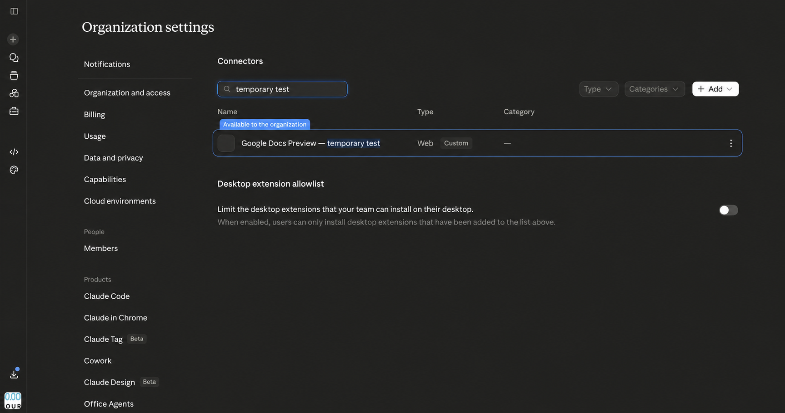

# Organization connector pilot

## Result

The Claude.ai organization connector passed on 30 July 2026.

- A Claude Owner published **Google Docs Preview — temporary test** to the
  80,000 Hours organization.
- The tester clicked **Connect**, continued to Google and authorized the Workspace
  account. No user Cloud project or credentials were required.
- Claude created an anchored comment, replied in its thread and created a real open
  suggested replacement.
- A final Preview API read recovered all three objects.
- The Google Docs UI showed the comment, reply and Accept/Reject controls for the
  suggestion.

## What this proves

The pilot proves one member’s complete flow and the shared-project architecture:
staff do not need their own Cloud projects or credentials. The design gives each user
a separate Google grant, and Claude receives an MCP token rather than the Google
token. A second member has not yet tested that design.

The tester is Project Owner on a project whose parent is the 80,000 Hours Google Cloud
organization. That was enough to configure its OAuth client. The account cannot read
organization IAM or list organization folders; neither permission is needed to operate
this existing project.

## What this does not prove

- Other Workspace organizational units may have different OAuth app controls.
- Every staff email still needs Google Developer Preview registration while the API is
  Pre-GA.
- The Docs OAuth scope is account-wide, not folder-scoped.
- The temporary Vercel and Redis resources are developer-owned, not production
  organization infrastructure.
- No Workspace Security Settings administrator reviewed the exact client during this
  run. The successful consent proves only that the tester’s current policy permits it.
- The broker has no subject-to-grant registry or administrator revocation endpoint.
  It cannot yet find and revoke a departed member’s grant without that member’s token
  or Google Workspace administrator action.

## Production decision

The one-member protocol and user flow passed. Before confidential use, move the
deployment, Redis store, encryption key, MCP client secret and administrators to
approved 80,000 Hours accounts; add a subject-bound grant registry and admin revoke
operation; and test with one person from a second organizational unit.
