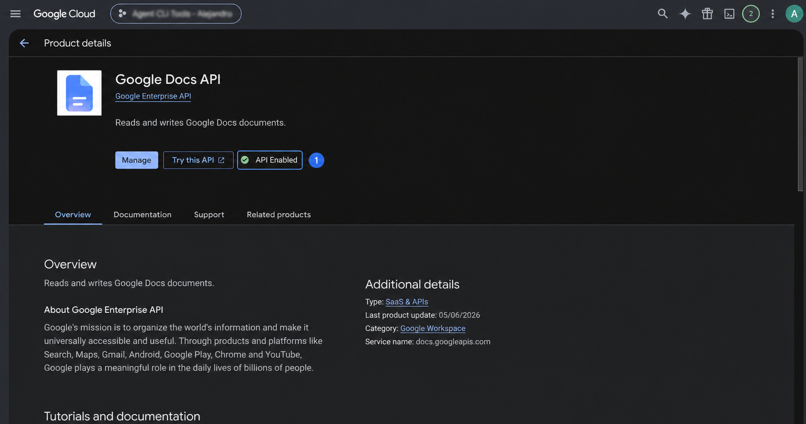
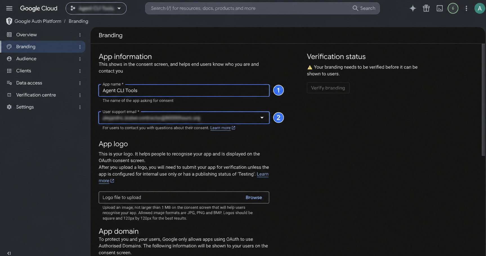
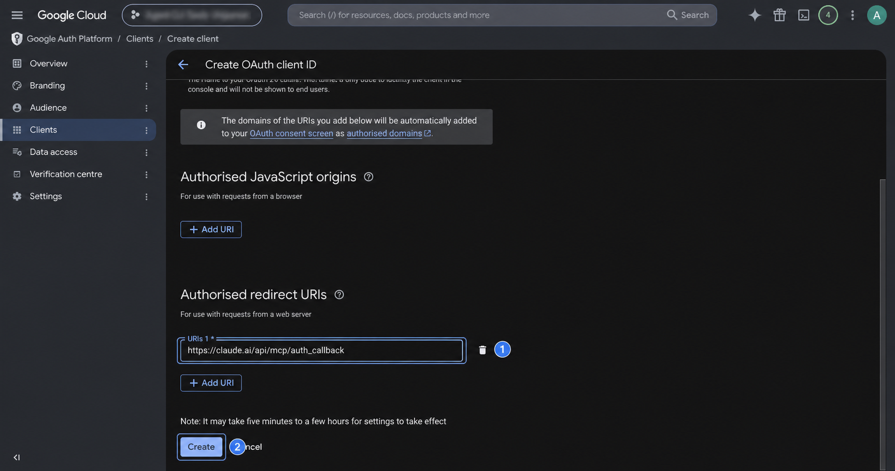
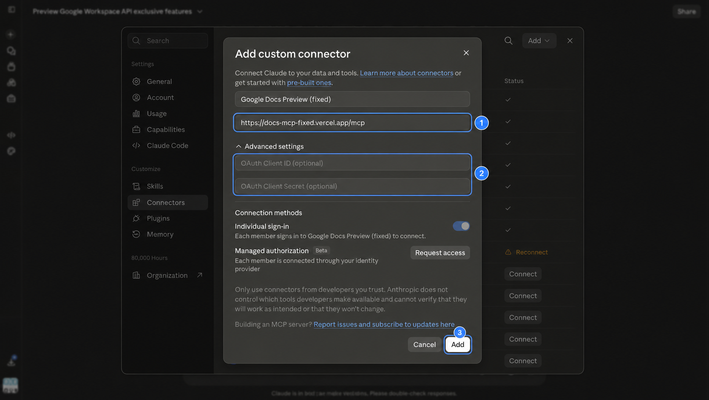
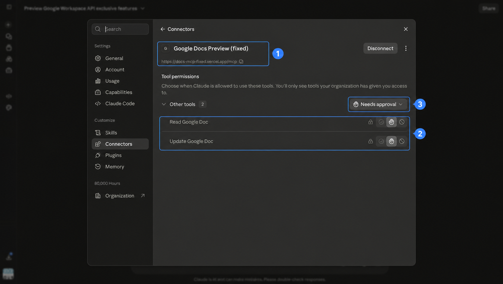

# Set up Google Docs comments and suggestions in Claude

This guide uses a custom MCP because [Google’s hosted Docs MCP omits the fields required for preview comments and suggestions](official-mcp-limitations.md).

## Choose the path first

| Path | Use it when | Security |
| --- | --- | --- |
| Local stdio | You can use Claude Desktop or Claude Code | Recommended for sensitive documents |
| Shared remote | You require Claude.ai and are testing non-sensitive documents | Experimental |
| Self-hosted remote | You require Claude.ai and control the host | Still experimental without a proper OAuth broker |

Claude.ai cannot connect directly to a local MCP. Its custom-connector requests originate from Anthropic’s cloud and require a public URL.

## Prerequisites

- A managed Google Workspace account eligible for the Developer Preview; a personal Gmail account is not enough.
- Permission to create or configure a Google Cloud project and OAuth clients.
- Developer Preview approval for the Workspace account and Cloud project.
- Node.js 20 or newer for the raw local server.
- Permission to edit Claude’s MCP configuration. On managed Claude Team or Enterprise plans, an Owner may need to add a remote connector.

Whichever path you choose, document content returned by the tool is sent to Claude for processing.

## Common Google setup

### 1. Create or select a Cloud project

Open [Google Cloud Console](https://console.cloud.google.com/), select the project picker, and create a project if needed.

Record:

- Project name: a label you choose
- Project ID: Google’s globally unique identifier
- Project number: Google’s numeric identifier

The preview form asks for the project number—not the name or project ID.

### 2. Apply for Developer Preview

Open the [Google Workspace Developer Preview form](https://docs.google.com/forms/d/e/1FAIpQLSd7BiMXXHDlUDkF7G0TSY5zfJbQwFNH3m6K_ZYFi3vCHLFbng/viewform) while signed into the Workspace account that will use the MCP.

Enter your own:

- name and organization;
- individual Workspace email;
- Cloud project number;
- use case, such as testing Docs comments and suggestions with Claude;
- intended Workspace products, including Docs.

You need the Cloud project before applying, but you do not need OAuth credentials yet.

Wait for Google to approve both the Workspace account and project before continuing.

### 3. Enable the Docs API

Enable `docs.googleapis.com` in the approved project.



The custom MCP does not call `docsmcp.googleapis.com`, so the Docs MCP API is not required.

### 4. Configure Google Auth Platform

Under **Google Auth Platform → Branding**, enter an app name and your own support and developer-contact emails.



Choose **Internal** when everyone who will use the client belongs to your Workspace organization and your administrator permits it. Otherwise configure the appropriate external audience.

Under **Data access**, add only:

```text
https://www.googleapis.com/auth/documents
```

Google describes this Sensitive scope as permission to see, edit, create, and delete all Google Docs documents. It is the minimum scope for a tool that accepts arbitrary document IDs. The narrower `drive.file` scope requires a Picker or per-file grant flow, which this prototype does not implement. Do not add full-Drive access unless a documented feature requires the Drive API.

For an External OAuth app:

- add each tester under **Audience → Test users** while the app is in Testing;
- expect refresh tokens from a Testing app using Sensitive scopes to expire after seven days;
- complete Google verification before broad external distribution.

These OAuth rules are separate from Workspace Developer Preview enrollment.

## Path A: local stdio

Use this path with Claude Desktop or Claude Code.

### 5A. Create a Desktop OAuth client

Under **Google Auth Platform → Clients**, create a client of type **Desktop app** and download its JSON file. Installed apps use a loopback redirect and PKCE; their embedded client secret is not treated as a confidential server secret.

Store the JSON outside the repository.

### 6A. Authorize locally

Clone the repository, then run:

```sh
npm test
npm run auth -- --client /path/to/desktop-oauth-client.json
```

The browser consent screen should request only Google Docs access. The resulting access token, refresh token, installed-client ID, and installed-client secret are written as plaintext JSON to:

```text
~/.config/google-docs-preview-mcp/token.json
```

The directory is mode `700`; the file is mode `600`. Those permissions reduce accidental disclosure to other local users. They do not encrypt the file or protect it from same-user malware or an administrator. A packaged release should use the OS keychain.

The authorization helper is tested on macOS. On other platforms, or if automatic browser opening fails, add `--no-open` and paste the printed URL into a browser:

```sh
npm run auth -- --client /path/to/desktop-oauth-client.json --no-open
```

### 7A. Add it to Claude Code

From the repository root:

```sh
command -v node
claude mcp add --scope user google-docs-preview-local -- \
  /ABSOLUTE/PATH/RETURNED/BY/command-v-node "$PWD/bin/docs-mcp-local.js"
```

Verify:

```sh
claude mcp get google-docs-preview-local
```

### 8A. Add it to Claude Desktop

Claude Desktop’s preferred distribution format is a `.mcpb` extension. Until this repository ships a signed bundle, add the stdio server to `claude_desktop_config.json`:

```json
{
  "mcpServers": {
    "google-docs-preview-local": {
      "command": "/ABSOLUTE/PATH/RETURNED/BY/command-v-node",
      "args": ["/ABSOLUTE/PATH/bin/docs-mcp-local.js"]
    }
  }
}
```

On macOS, Claude Desktop exposes this file through **Settings → Developer → Edit Config** and stores it at `~/Library/Application Support/Claude/claude_desktop_config.json`. Preserve existing keys and restart Claude Desktop. GUI apps may not inherit your shell `PATH`, which is why the Node command must be absolute.

The tested local connector recovered two open comment threads and one open suggestion:


## Path B: shared experimental remote

Use this only for non-sensitive testing in Claude.ai. Read the [remote threat model](design-and-security.md#current-experimental-remote) first.

### 5B. Create a Web OAuth client

Create a **Web application** client with this exact authorized redirect URI:

```text
https://claude.ai/api/mcp/auth_callback
```



Copy its client ID and secret. Never commit, publish, or screenshot the secret. Each user of the shared endpoint must supply their own Web client; never distribute the endpoint operator’s client secret.

### 6B. Add the remote connector

In Claude, open **Customize → Connectors → Add → Add custom connector**:

- Name: `Google Docs Preview`
- Remote MCP URL: `https://docs-mcp-fixed.vercel.app/mcp`
- OAuth client ID and secret: your own web client



Connect the intended Workspace account and approve the Docs scope.



The MCP server does not receive the OAuth client secret; it is supplied to Claude/Anthropic’s connector configuration for the OAuth flow. Do not assume anything further about the client’s storage implementation. The server does process the resulting Google access token and document payloads.

## Path C: self-host the experimental remote

Deploying the same proxy replaces this project’s Vercel account with your deployment account. Vercel still processes tokens and document payloads:

```sh
npm test
vercel --prod --yes
```

Use the production `/mcp` URL in step 6B. Verify:

```sh
curl https://YOUR-PRODUCTION-ORIGIN/health
curl -i https://YOUR-PRODUCTION-ORIGIN/mcp
```

The health route should return JSON with `"ok": true`; the unauthenticated MCP route should return an authorization challenge, not a successful tool response. Vercel supplies a canonical production origin automatically. On another host, set `DOCS_MCP_PUBLIC_ORIGIN` to the exact public HTTPS origin.

Self-hosting does not fix the protocol problem: the proxy still forwards Google tokens unchanged. A production remote service needs [separate MCP and Google authorization](design-and-security.md#production-remote).

## Verify comments and suggestions

Use the canonical [verification prompt and expected result](testing.md). Test on a disposable document and grant one-time, per-call approval for each write.

## Troubleshooting

### Google says the app is not approved for the preview

Confirm that the signed-in Workspace email and Cloud project number match the preview application.

### Local authorization returns no refresh token

Run the authorization command again. It uses `prompt=consent` so Google returns a refresh token.

### Local authorization fails with `invalid_grant`

Delete the local token file and authorize again. If an External app is still in Testing, its seven-day refresh-token lifetime is a common cause.

### Claude cannot find the local connector

- Restart Claude Desktop after editing its configuration.
- Use an absolute path.
- Run `node bin/docs-mcp-local.js` from a terminal and confirm it starts without writing logs to stdout.
- In Claude Code, run `claude mcp get google-docs-preview-local`.

### Suggestions become direct edits

Require top-level:

```json
{"writeControl":{"writeMode":"SUGGEST"}}
```

Do not let the client substitute a direct edit.

Not every Docs request or formatting operation supports suggest mode. After comment or suggestion batches, inspect `commentUpdateState` and `suggestionResponses`; Google can report partial or failed comment persistence separately from the HTTP status.

## Disconnect and revoke

Disconnecting Claude stops the connector but does not revoke Google’s grant. To remove access completely:

1. Remove `google-docs-preview-local` from Claude Desktop or run `claude mcp remove --scope user google-docs-preview-local`.
2. Delete `~/.config/google-docs-preview-mcp/token.json`.
3. Revoke the app under [Google Account connections](https://myaccount.google.com/connections).

For a remote connector, remove it from Claude and revoke the Google grant. Rotate the Web OAuth client secret only if that secret itself was exposed.

## Values that must be your own

Never copy these from screenshots:

- Workspace email
- Cloud project ID or number
- OAuth client ID or secret
- OAuth credential JSON
- local token file

Stable values:

- Claude callback: `https://claude.ai/api/mcp/auth_callback`
- Google scope: `https://www.googleapis.com/auth/documents`
- Experimental endpoint: `https://docs-mcp-fixed.vercel.app/mcp`
