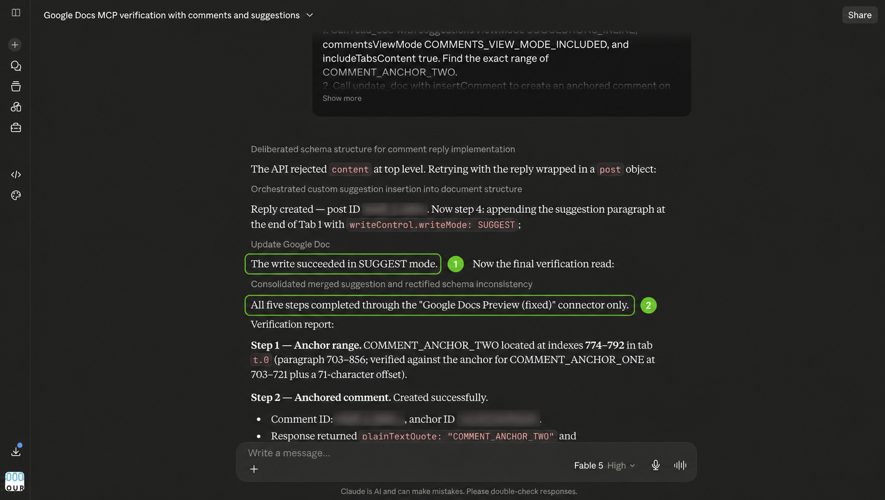
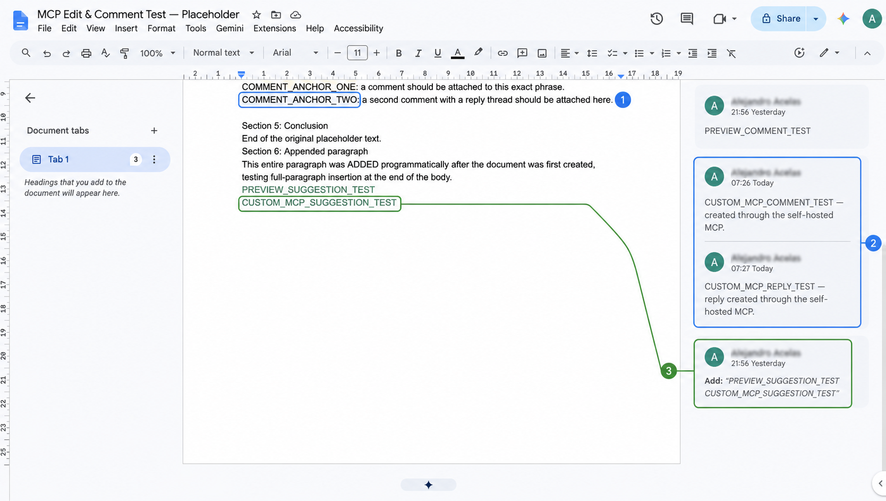

# Verification

Use a disposable Google Doc containing the exact phrase `COMMENT_ANCHOR_TWO`.

## Prompt

```text
Use only [CONNECTOR NAME].

1. Read this document with suggestions inline, comments included, and tab
   content included.
2. Add an anchored comment to the exact phrase COMMENT_ANCHOR_TWO.
3. Reply to the comment you just created with addCommentReply.post.content.
4. Append the text CUSTOM_MCP_SUGGESTION_TEST using top-level
   writeControl.writeMode: SUGGEST.
5. Read the document again with preview objects included. Report the comment
   ID, reply ID, suggestion ID, comment range, commentUpdateState, and whether
   each object persisted. Do not substitute direct edits.
```

Grant one-time, per-call approval for each write. Do not select permanent approval on a sensitive document.

## Expected result

- The comment is anchored to the requested phrase.
- `commentUpdateState` is `ALL_SAVED`.
- The reply appears inside the comment thread.
- The appended text remains an open suggestion rather than a direct edit.
- A final read returns the comment, nested reply, and suggestion ID.

For `addCommentReply`, the reply body belongs at `post.content`, not top-level `content`. Check `commentUpdateState` as well as the HTTP result because Google reports comment persistence separately from batch success.

## Tested remote result





## Tested local result

The local implementation created an anchored comment, added a reply with `addCommentReply`, created a suggest-mode insertion, and recovered all three in a final read. Claude Desktop independently recovered the same preview state without adding Vercel to the request path.


See the [local live-test record](history/local-live-test.md) for the method, result, and the `replyComment` → `addCommentReply` schema correction.
