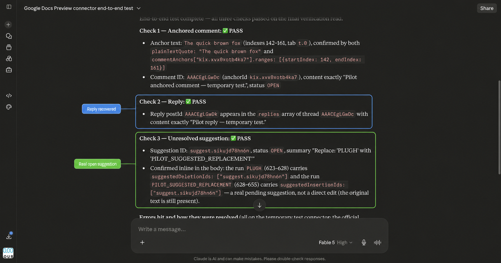
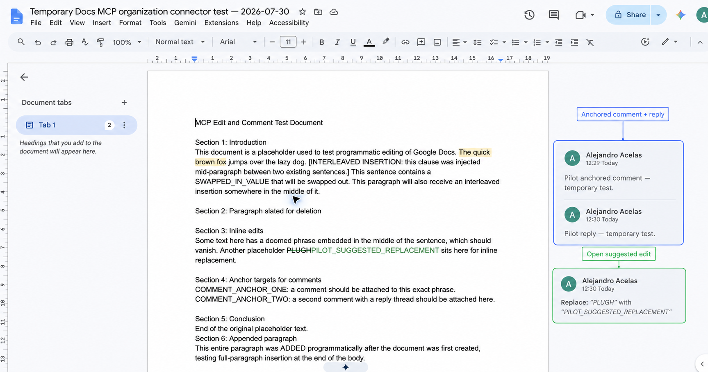
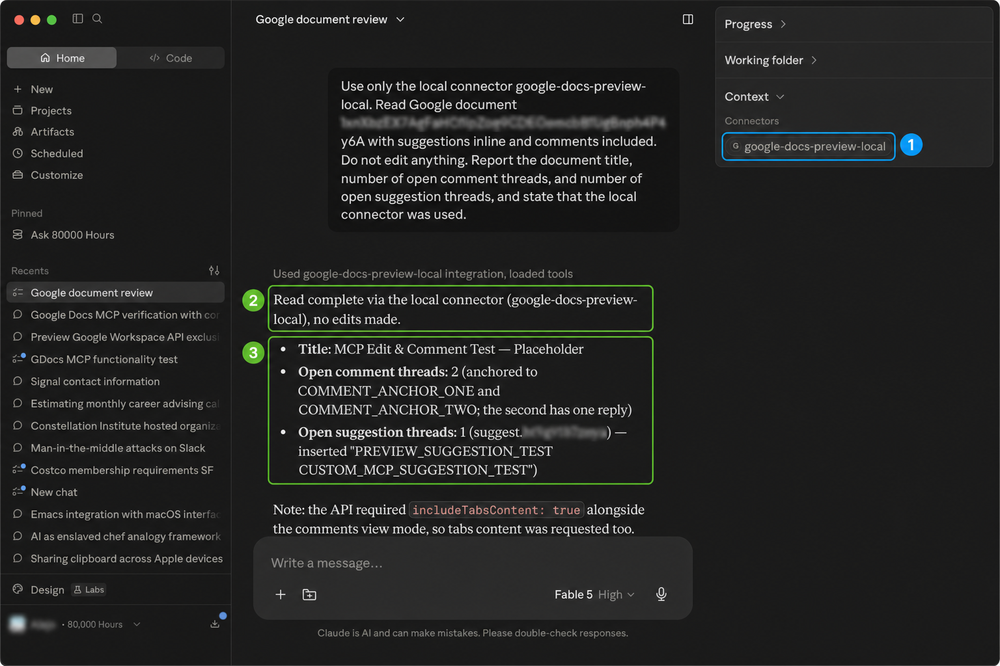

# Verification

Use a disposable Google Doc containing the exact phrase `COMMENT_ANCHOR_TWO`.

## Prompt

```text
Use only [CONNECTOR NAME].

1. Read this document with suggestions inline, comments included, and tab
   content included. The connector automatically adds includeTabsContent=true
   when comments are requested.
2. Add an anchored comment to the exact phrase COMMENT_ANCHOR_TWO.
3. Reply to the comment you just created with addCommentReply.post.content.
4. Append the text CUSTOM_MCP_SUGGESTION_TEST using top-level
   writeControl.writeMode: SUGGEST.
5. Read the document again with preview objects included. Report the comment
   ID, reply ID, suggestion ID, comment range, commentUpdateState, and whether
   each object persisted. Do not substitute direct edits.
```

Grant one-time, per-call approval for each write. Do not select permanent approval on a sensitive document.

## Expected result

- The comment is anchored to the requested phrase.
- `commentUpdateState` is `ALL_SAVED`.
- The reply appears inside the comment thread.
- The appended text remains an open suggestion rather than a direct edit.
- A final read returns the comment, nested reply, and suggestion ID.

For `addCommentReply`, the reply body belongs at `post.content`, not top-level `content`. Check `commentUpdateState` as well as the HTTP result because Google reports comment persistence separately from batch success.

## Tested Claude.ai organization result

The organization connector created and recovered an anchored comment, its reply and an
open replacement suggestion. The Google Docs UI independently showed the thread and
the suggestion’s Accept/Reject controls.





See the [organization connector pilot record](reproduce/organization-connector-pilot.md).

## Tested local result

Claude Code used the local MCP to create an anchored comment, add a reply with `addCommentReply`, create a suggest-mode insertion, and recover all three in a final read. Every write returned `commentUpdateState: ALL_SAVED`. Claude Desktop independently recovered preview state through the same connector without adding Vercel to the request path.



See the [local live-test record](reproduce/local-live-test.md) for the method, result, and the `replyComment` → `addCommentReply` schema correction.
